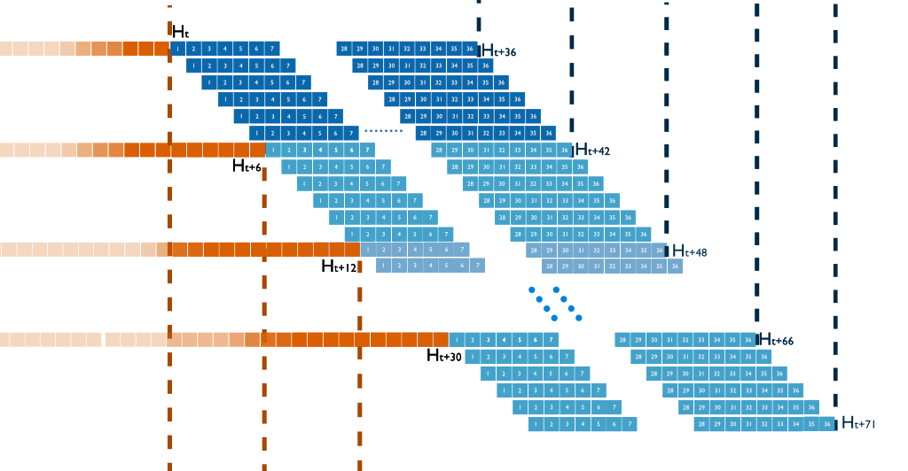

# Evaluation Strategy

| ADR Info            | Details           |
|---------------------|-------------------|
| Subject             | Evaluation Strategy  |
| ADR Number          | 002   |
| Status              | Accepted|
| Author              | Mihai, Xiaolong|
| Date                | 31.10.2024 |

## Context
The primary output of VIEWS is a panel of forecasts, which consist of temporal sequences of predictions for each observation at the corresponding level of analysis (LOA). These forecasts span a defined forecasting window and can represent values such as predicted fatalities, probabilities, quantiles, or sample vectors.

The machine learning models generating these predictions are trained on historical time-series data, supplemented by covariates that may be either known in advance (future features) or only available for training data (shifted features). Given the variety of models used, evaluation routines must remain model- and paradigm-agnostic to ensure consistency across different methodologies.

## Decision
The evaluation strategy must be structured to assess predictive performance comprehensively.

### Points of Definition: 

1. *Time*: All time points and horizons mentioned below are in  **outcome space**, also known as $Y$-space : this means that they refer to the time point of the (forecasted or observed) outcome. This is especially important for such models where the feature-space and outcome-space are shifted and refer to different time points.

2. *Temporal resolution*: The temporal resolution of VIEWS is the calendar-month. These are referred in VIEWS by an ordinal (Julian) month identifier (`month_id`) which is a serial numeric identifier with a reference epoch (month 0) of December 1979. For control purposes, January 2024 is month 529. VIEWS does not define behavior and does not have the ability to store data prior to the reference epoch (with negative `month_id`). Conflict history data, which marks the earliest possible meaningful start of the training time-series, is available from `month_id==109`.

3. *Forecasting Steps* (further referred to as steps) is defined as the 1-indexed number of months from the start of a forecast time-series.

### General Evaluation Strategy

The general evaluation strategy involves *training* one model on a time-series that goes up to the training horizon $H_0$. This sequence is then used to predict a number of sequences (time-series). The first such sequence goes from $H_{0+1}$ to $H_{0+36}$, thus containing 36 forecasted values -- i.e. 36 months. The next one goes from $H_{0+2}$ to $H_{0+37}$. This is repeated until we reach a constant stop-point $k$ such that the last sequence forecasted is $H_{0+k+1}$ to $H_{0+k+36}$. 

Normally, it is up to the modeller whether the model performs *expanding window* or *rolling window* evaluation, since *how* prediction is carried out all evaluations are of the *expanding window forecasting* type, i.e. the training window. 

#### Live evaluation

For **live** evaluation, we suggest doing this in the same way as has been done for VIEWS2020/FCDO (_confirm with HH and/or Mike_), i.e. predict to k=12, resulting in *12* time series over a prediction window of *48* months. We call this the evaluation partition end $H_{e,live}$. This gives a prediction horizon of 48 months, thus $H_{47}$ in our notation.

Note that this is **not** the final version of online evaluation.

#### Offline evaluation

For **offline** model evaluation, we suggest doing this in a way that simulates production over a longer time-span. For this, a new model is trained at every **twelve** months interval, thus resetting $H_0$ at months $H_{0+0}, H_{0+12}, H_{0+24}, \dots H_{0+12r}$ where $12r=H_e$.

The default way is to set $H_{e_eval}$ to 48 months, meaning we only train the model once at $H_0$. This will result in **12** time series. We call it **standard** evaluation.

We also propose the following practical approaches:

1. A **long** evaluation where we set $H_{e_eval}$ to 72 months. This will result in *36* predicted time-series.
   
2. A **complete** evaluation system, the longest one, where we set $H_0$ at 36 months of data (157 for models depending on UCDP GED), and iterate until the end of data (currently, the final $H_0$ will be 529).

For comparability and abstraction of seasonality (which is inherent in both the DGP as well as the conflict data we rely on, due to their definition), $H_0$ should always be December or June (this also adds convenience).

The three approaches have trade-offs besides increasing computational complexity.  Since conflict is not a stationary process, evaluation carried for long time-periods will prefer models that predict whatever stationary components exist in the DGP (and thus in the time-series). For example these may include salient factors such GDP, HDI, infant mortality etc.. Evaluation on such very long time-spans may substantially penalize models that predict more current event, due shorter term causes that were not so salient in the past. Examples of these may be the change in the taboo on inter-state war after 2014 and 2022 with Russia invading Ukraine.

## Consequences

**Positive Effects:**
- Standardized evaluation across models, ensuring comparability.

- Clear separation of live and offline evaluation, facilitating both operational monitoring and research validation.

**Negative Effects:**
- Increased computational demands for long and complete evaluations.

- Potential complexity in managing multiple evaluation strategies.

- Additional infrastructure requirements.

## Rationale
By structuring evaluation routines to be agnostic of the modeling approach, the framework ensures consistency in assessing predictive performance. Using multiple evaluation methodologies balances computational feasibility with robustness in performance assessment.

### Considerations
- Computational cost vs. granularity of evaluation results.

- Trade-offs between short-term and long-term predictive performance.

- Ensuring reproducibility and scalability of evaluation routines.

## Feedback and Suggestions
Feedbacks and suggestions are welcomed.

