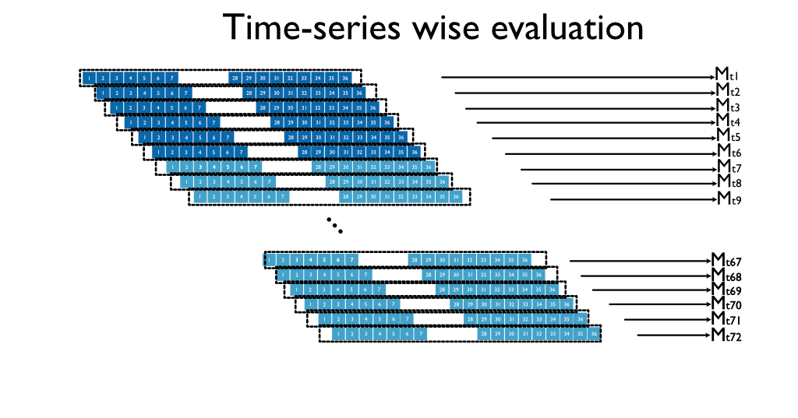
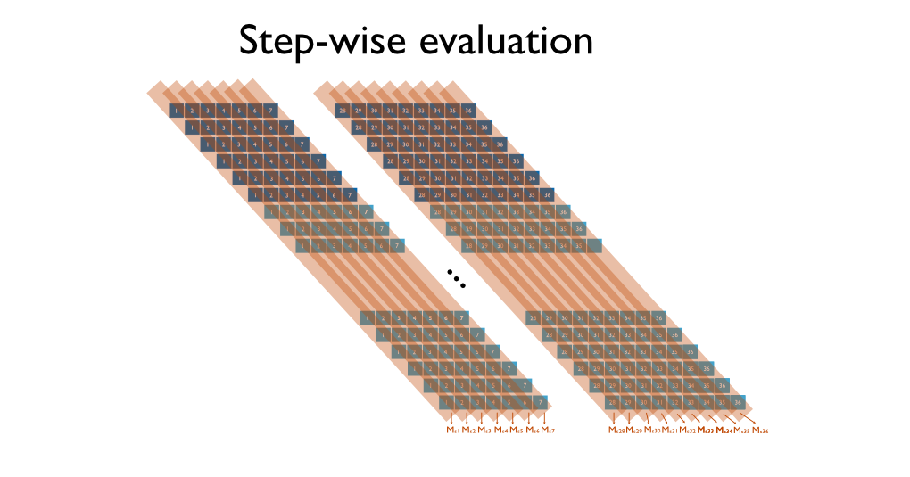
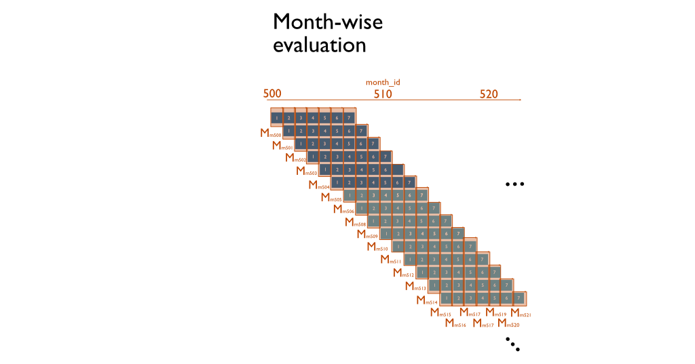

# Metric Calculation

| ADR Info            | Details           |
|---------------------|-------------------|
| Subject             | Metric Calculation  |
| ADR Number          | 003   |
| Status              | Accepted|
| Author              | Mihai, Xiaolong|
| Date                | 31.10.2024 |

## Context
A major challenge in VIEWS' forecasting system is the need for an evaluation framework that accurately reflects predictive performance across various time horizons. Traditional machine learning evaluation metrics do not directly translate to time-series forecasting. A well-defined and standardized approach to metric calculation is necessary to ensure reliability, interpretability, and comparability.

## Decision
Evaluation metrics will be computed in three different ways to capture various aspects of predictive performance:

### Time-series-wise Evaluation: 

The first is evaluating *along the sequence*. For each 36-month time-series, predictions are computed, and a metric (MSE) is compared against the actuals over the entire time-series (i.e. for the 36 months). This shows *how good the predictive power of the time-series is on average against the actuals*. This will result in 12 computed values for the *live* and *standard* offline evaluation, 36 for the *long* and a variable number, currently *342* for the complete evaluation. These can be averaged, CIs computed etc. This is the standard approach done in most machine learning for time-series methods, and is what packages like _darts_ or _prophet_ normally provide. This method also allows for some extra metrics that cannot be implemented in other evaluation approaches -- such as tests for Granger causality or Sinkhorn distances to evaluate whether we overshoot or undeshoot temporally the dynamics of conflict.

### Step-wise Evaluation

The second is the standard approach computed in VIEWS, VIEWS2020 and FCDO, and the standard employed for ALL the existing systems. This approach entails taking the predictions and actuals from each step from each model output. These are then assembled and aligned to create, for each step, a sequence. This sequence is then used to compute a metric valid for that respective step. The purpose of this is to verify which models predict best closest to the training horizon (thus have short-term predictive power), and which do best further along the prediction axis (thus have long-term predictive power). Therefore, irrespective of approach used, this will result in 36 such stepwise metrics (one for step 1, one for step 2, one for step 3).

### Month-wise Evaluation

The third approach entails collecting all predictions for a given calendar month in their own respective sequences, and computing predictions against actuals from that respective month. This will always result in some months having far fewer predictions and some having more due to the parallelogram nature of the process. This is useful for accounting for for the effects of very rare events happening in only very few months on the predictions (e.g. 9/11).

## Consequences

**Positive Effects:**
- Provides a holistic view of model performance over time.

- Allows for deeper insights into the strengths and weaknesses of different models.

- Facilitates more accurate model selection.

**Negative Effects:**
- Increased complexity in computing multiple types of metrics.

- Greater computational resource requirements for large-scale evaluations.

- Potential need for additional infrastructure to store and retrieve metric results efficiently.

## Rationale
Given the nature of VIEWS forecasting, it is crucial to evaluate models in ways that reflect their real-world application. A multi-faceted approach to metric computation ensures that both short-term and long-term predictive performance is appropriately assessed. By standardizing metric calculations, we create a consistent foundation for model comparison and improvement.

### Considerations
- Balancing computational efficiency with evaluation granularity.

## Feedback and Suggestions
Feedbacks and suggestions are welcomed.

